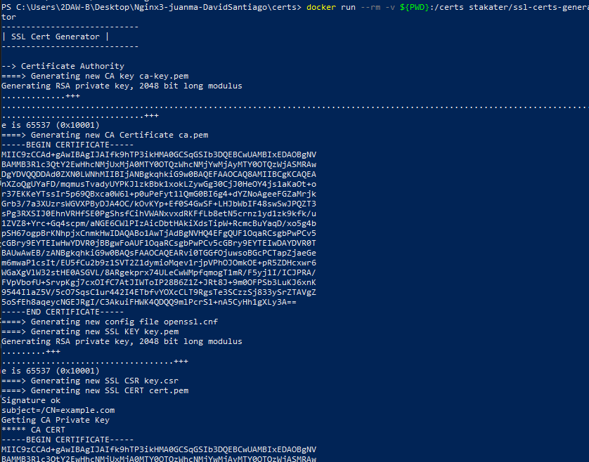
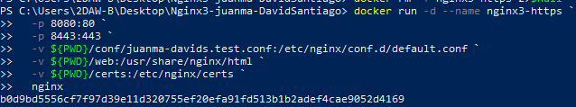

 - Importamos la maquina de Nginx 2 para hacer Nginx 3.

## Configuracion Nginx
- En la practica Nginx creamos un archivo nuevo llamado conf, donde creare un bloc de notas donde pondre la ruta y un dominio de pruebas.

- Luego creo el dominio de pruebas. Para acceder a él necesitamos entrar como administrador a C:\Windows\System32\drivers\etc\hosts y añadimos esas dos ultimas lineas, la ruta y el dominio.

## Generar un certificado SSL
- Nos descargamos la imagen que genera certificados.

- Creamos certs en nuestra carpeta.

- Generamos los certificados dentro de certs.

## Configuracion
- Ahora que tengo el certificado, le voy a decir a Nginx que use el certificado que he descargado.
- Nos volvemos al .conf que habia creado, y lo configuro añadiendole las rutas creadas dentro del contenedor.

- Levantamos el Docker para ver si funciona.

- Lo ejecutamos en local para asegurarnos http://juanma-davids.test:8080

## Mapeo de puertos y montaje de volumen de certificados
- Cambiamos los puertos

