# PRACTICA Python, Flask y Gunicorn #

## Instalamos Python ##
- Dentro de la máquina virtual, instalamos el gestor de paquetes de Python y la herramienta de entornos virtuales:
- Actualizar repositorios e instalar pip:
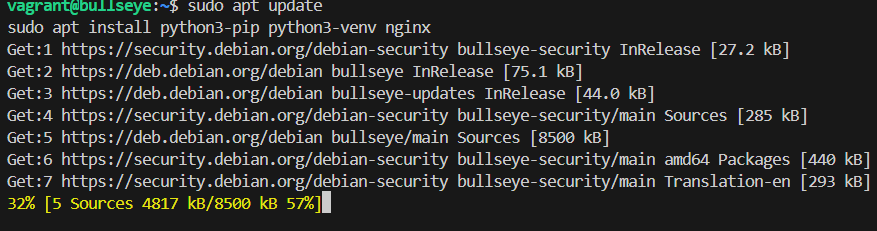
- Instalar pipenv:
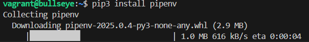
- Comprobamos que este instalado:
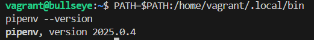
- Instalamos dotenv:

- Configurar el PATH para reconocer Pipenv:
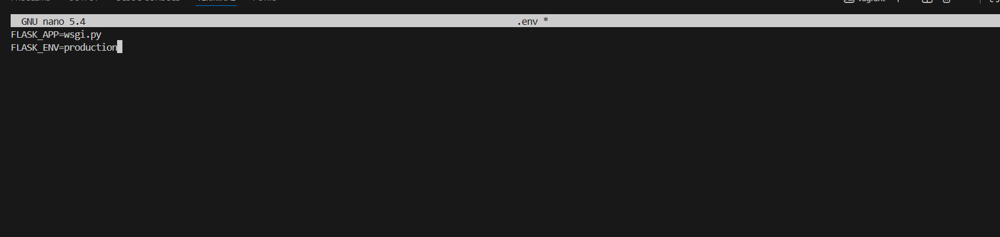

- Creamos la estructura de directorios y gestionamos los permisos para el servidor web:
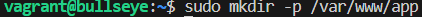
- Y le damos permisos para el root, sin esto no funcionaria bien:

## Configuracion de Python y Flask ##
- Iniciamos el entorno 
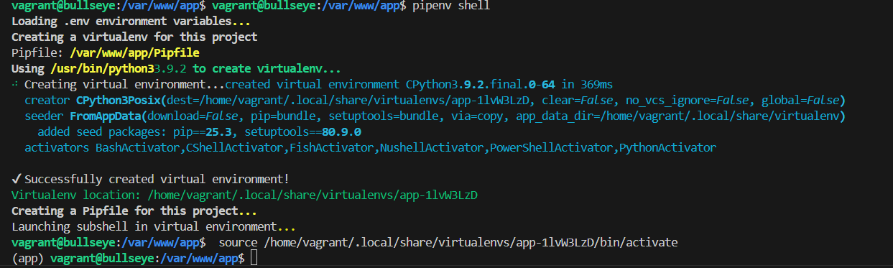
- Dentro del entorno descargamos flask
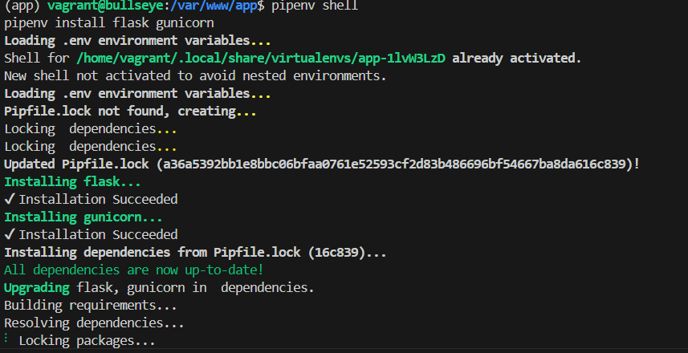
- Creamos los archivos .py
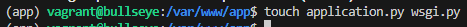
- Abrimso application.py, wsgi.py y los editamos
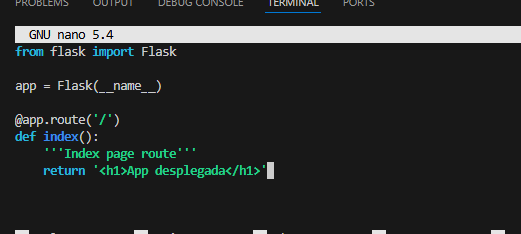
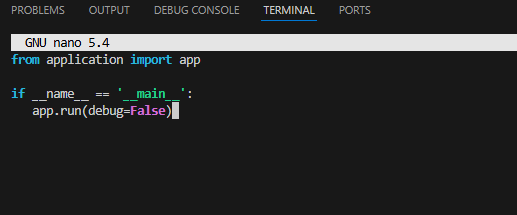
- Comprobamos si Gunicorn arranca.
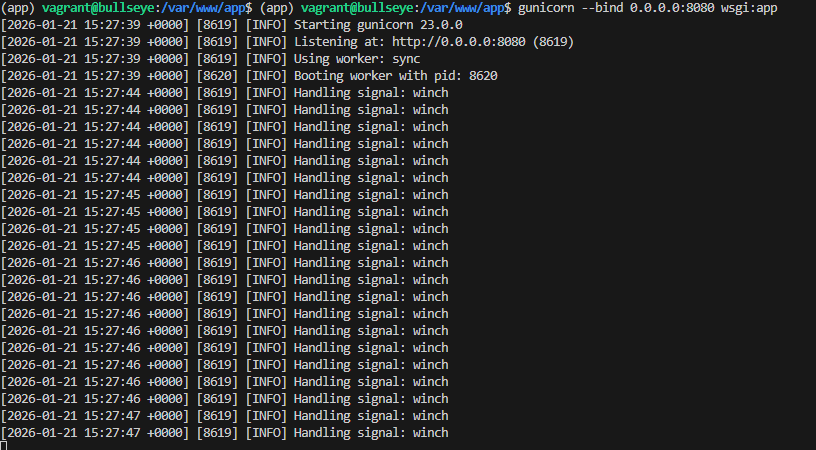

## Crear el servicio en Systemd ##
Para que la aplicación no se detenga al cerrar la terminal, hay que crear un servicio del sistema.
- Creamos el archivo y ajustamos el contenido:
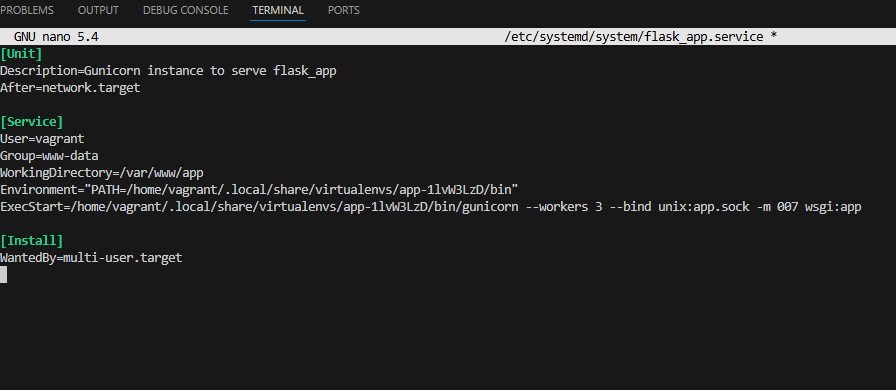
- Y iniciamos el servidor:
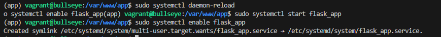

## Configurar Nginx como Proxy Inverso ##
Ahora configuramos Nginx para que reciba las peticiones por el puerto 80 y las pase al archivo app.sock que creó Gunicorn.
- Instalamos Nginx
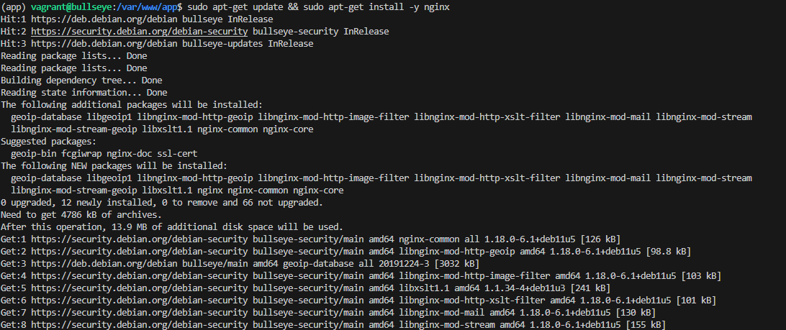
- Luego creamos el archivo sites-available, y lo configuramos para que responda a app.izv y www.app.izv:
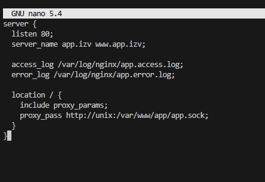
- Para finalizar reiniciamos Nginx:
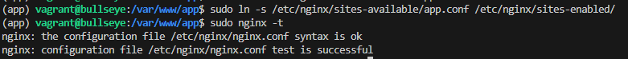

## Configurar el archivo HOSTS en Windows ##
- Desplegamos la web con la ruta http://app.izv/:
