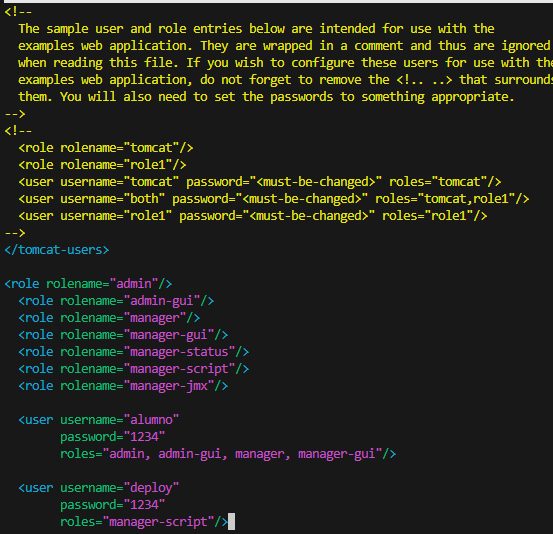
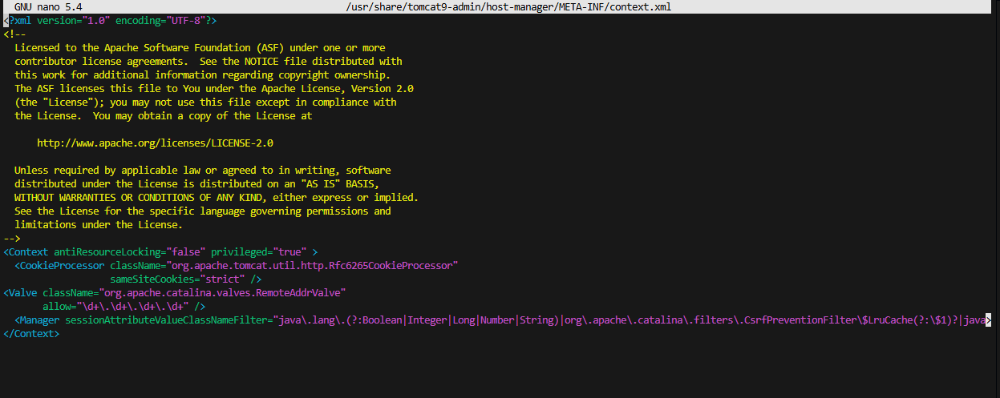
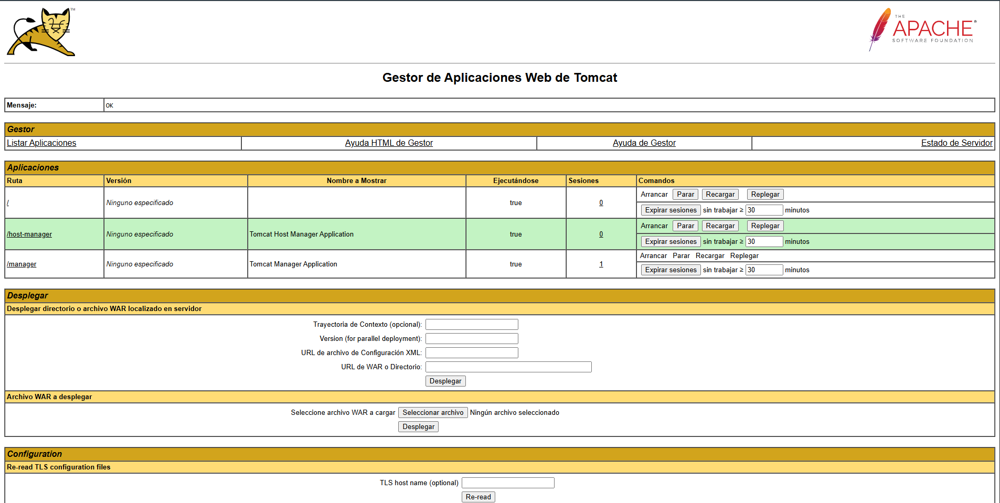
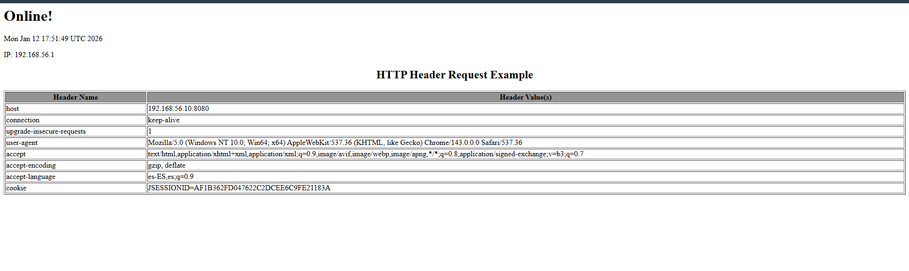

# PRACTICA Python, Flask y Gunicorn #

## Instalamos Python ##
- b.

- Descarga y despliegue de los binarios del servidor Apache Tomcat 9.

- Se crean grupos de sistema y un usuario específico para ejecutar el servicio de Tomcat con los permisos mínimos necesarios.

- Se inicia el servicio mediante systemctl y se comprueba que su estado sea "active (running)".

Para acceder al servidor desde la máquina anfitriona, Windows en mi caso, no se puede utilizar localhost debido al aislamiento de la máquina virtual. Se utiliza el comando hostname -I para obtener la dirección IP de la red privada. Inicialmente se detectaron restricciones de acceso que fueron solventadas modificando los parámetros de seguridad en los archivos de configuración.
Me daba error al principio en comprobar, he cambiado en el nano las restricciones de algunos parametros, se me quedaria asi el nano.

## Despliegue manual mediante GUI ##
Para gestionar aplicaciones mediante la web, es necesario configurar los roles de administración y permitir el tráfico desde redes externas.
- Se edita el archivo tomcat-users.xml para definir el usuario alumno con los roles manager-gui y admin-gui.

- Se modifica el archivo context.xml para permitir conexiones desde cualquier IP mediante la configuración de la Valve RemoteAddrValve.

- Comprobamos si funciona, accedemos con la url http://192.168.56.10:8080/manager/html

- Se realiza la subida manual del archivo tomcat1.war. Tras el despliegue, la aplicación es accesible cambiando la ruta de acceso en el navegador.

## Instamalos Maven ##
Maven permite compilar, empaquetar y desplegar aplicaciones de forma automática sin usar la interfaz web.
- Se descarga el gestor de dependencias en la máquina Debian.

- Se edita settings.xml de Maven para incluir las credenciales del usuario con rol manager-script.

- Creación de una aplicación web de prueba mediante el uso de arquetipos de Maven.

- Se integra el plugin tomcat7-maven-plugin para habilitar la comunicación entre Maven y el servidor Tomcat.

- Se ejecutan comandos de despliegue (deploy), actualización de la aplicación (redeploy) y retirada de la misma (undeploy).

- Volvemos a desplegarla

- Retiramos la aplicaicon

## Tarea ##
Como ejercicio final se realiza el ciclo completo: obtención de código fuente, cambio de versión y despliegue automático.
- Se descarga el código fuente del juego "Rock-Paper-Scissors" desde GitHub y se selecciona la rama patch-1.

- Adaptación del pom.xml del juego para incluir las credenciales de nuestro servidor local.

- Acceso final a la aplicación funcionando correctamente en la dirección http://192.168.56.10:8080/juego.
