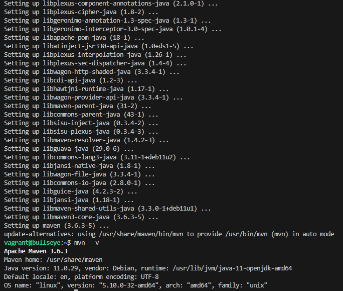
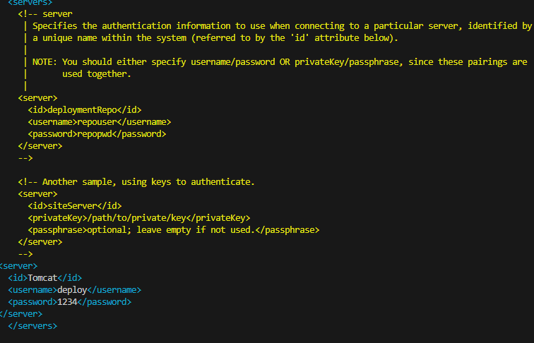
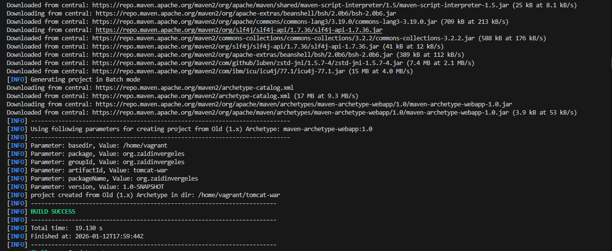
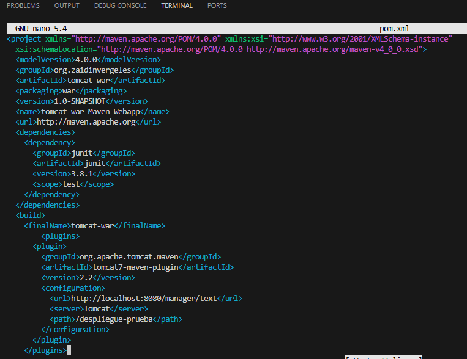
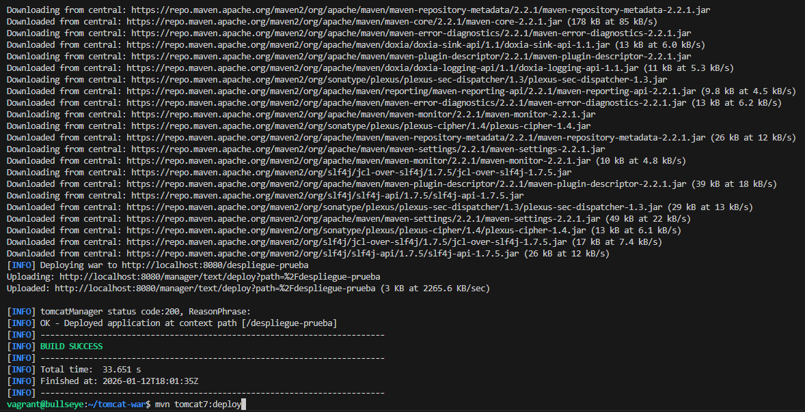
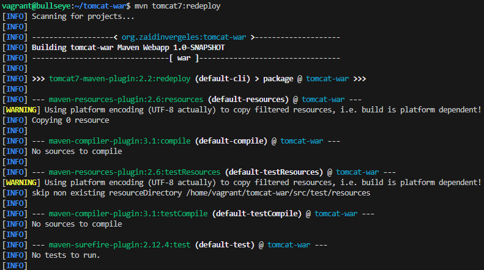
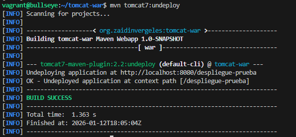
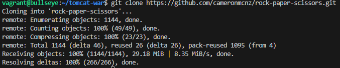
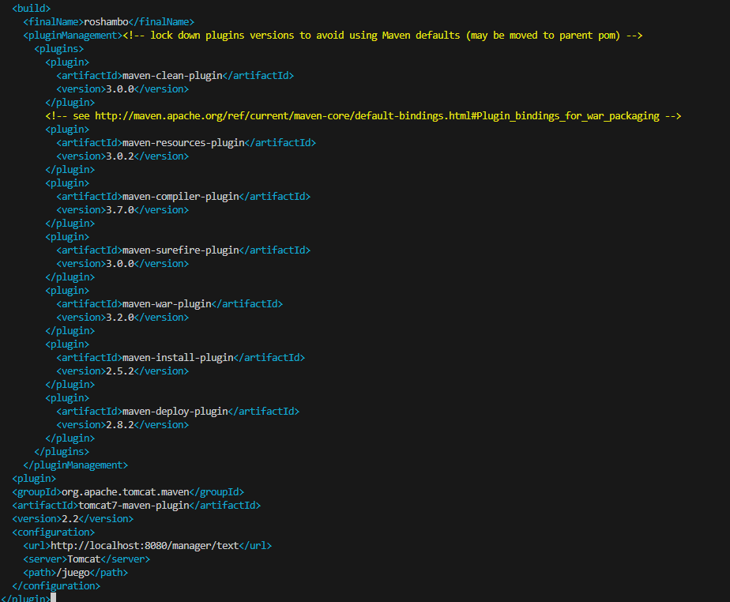
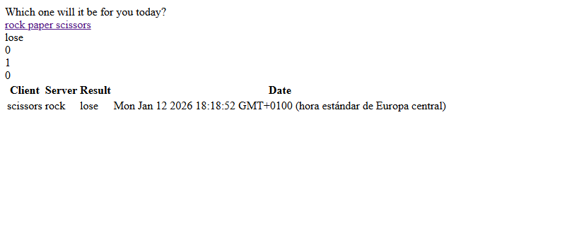

# PRACTICA Python, Flask y Gunicorn #

## Instalamos Python ##
- Dentro de la máquina virtual, instalamos el gestor de paquetes de Python y la herramienta de entornos virtuales:
- Actualizar repositorios e instalar pip:

- Instalar pipenv:

- Comprobamos que este instalado:

- Instalamos dotenv:

- Configurar el PATH para reconocer Pipenv:

- Creamos la estructura de directorios y gestionamos los permisos para el servidor web:

- Y le damos permisos para el root, sin esto no funcionaria bien:

## Configuracion de Python y Flask ##
- Iniciamos el entorno 

- Dentro del entorno descargamos flask

- Creamos los archivos .py

- Abrimso application.py, wsgi.py y los editamos

## Instamalos Maven ##
Maven permite compilar, empaquetar y desplegar aplicaciones de forma automática sin usar la interfaz web.
- Se descarga el gestor de dependencias en la máquina Debian.

- Se edita settings.xml de Maven para incluir las credenciales del usuario con rol manager-script.

- Creación de una aplicación web de prueba mediante el uso de arquetipos de Maven.

- Se integra el plugin tomcat7-maven-plugin para habilitar la comunicación entre Maven y el servidor Tomcat.

- Se ejecutan comandos de despliegue (deploy), actualización de la aplicación (redeploy) y retirada de la misma (undeploy).

- Volvemos a desplegarla

- Retiramos la aplicaicon

## Tarea ##
Como ejercicio final se realiza el ciclo completo: obtención de código fuente, cambio de versión y despliegue automático.
- Se descarga el código fuente del juego "Rock-Paper-Scissors" desde GitHub y se selecciona la rama patch-1.

- Adaptación del pom.xml del juego para incluir las credenciales de nuestro servidor local.

- Acceso final a la aplicación funcionando correctamente en la dirección http://192.168.56.10:8080/juego.
